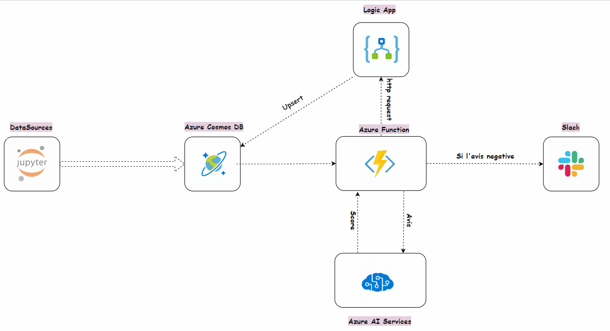
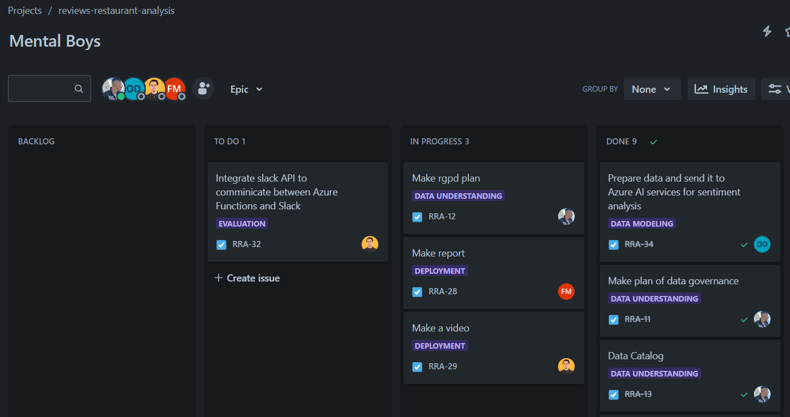

# Restaurant Reviews Data Pipeline with Azure Services

## Project Overview

The goal of this project is to establish a comprehensive data pipeline using Azure services to store, process, and analyze restaurant reviews. The emphasis is on leveraging Azure Cosmos DB, Azure Functions, Azure Cognitive Services, and Azure Logic Apps while adhering strictly to data governance principles and GDPR compliance.

## Implementation

This is a school project, so all the data used here is generated and fake. As a team, we started with a business understanding where we defined the project objectives. More information about it can be found in this repository under "docs -> specifications.pdf". After that, we performed data understanding, including exploration of the available data, and created a data catalog, GDPR plan, and data governance. These documents can be found in the `docs` folder of this project.

We created a project plan using Jira:

### Data Flow Explanation:

- Data is generated using Python locally. Personal data is encrypted, and the data is sent to Azure Cosmos DB.
- Azure Functions use a Cosmos DB trigger to listen for new documents added to Cosmos, capture the data, connect with Azure AI services using the Language API, calculate the score for the review, add that score to the document, and send it to Azure Logic App using an HTTP Request. If the score is negative, Azure Functions send a message to a Slack channel.
- Once the request is received by Logic App, it updates the Cosmos DB Container.
